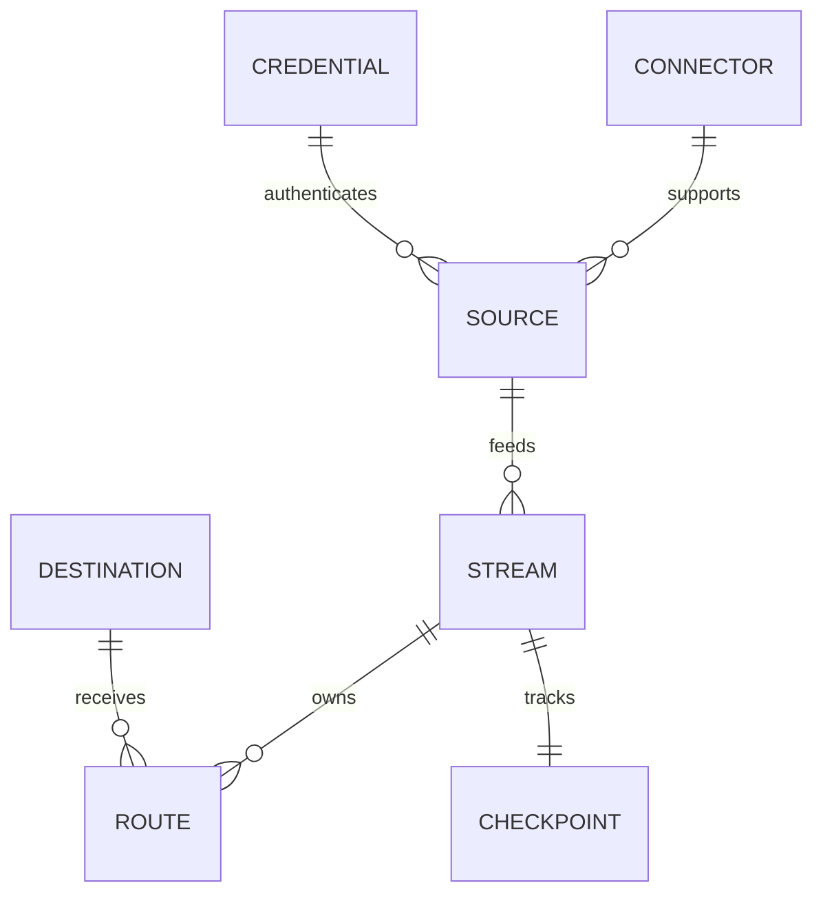

# 데이터 모델

Stream은 실행/checkpoint 소유 단위입니다. Route는 목적지별 processing/delivery 단위입니다. Credential은 secret을 package와 분리해 소유합니다. Source Pack은 runtime process가 아닙니다.

실제 DB schema는 Alembic migration이 관리하며 PostgreSQL이 유일한 플랫폼 DB입니다.
