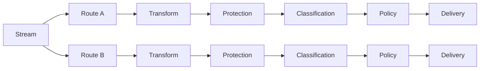

# Route Processing

The current processing model is:

```text
One Stream
  ↓
Many Routes
  ↓
Many Destinations
```

Each Route is a **destination-specific processing unit**.



## Inheritance

Routes can inherit shared/default processing and override only the concern that differs for a specific destination.

This avoids creating multiple Streams solely because two destinations require different field mappings or protection policies.

## Persist caveat

The current known-limitations record identifies **Intent only** cases for incomplete Classification or Protection override payloads. If Deploy shows Intent only where you expected a persisted override, open the Route editor after deploy, save a complete configuration, and verify Effective Status reports Overridden.
