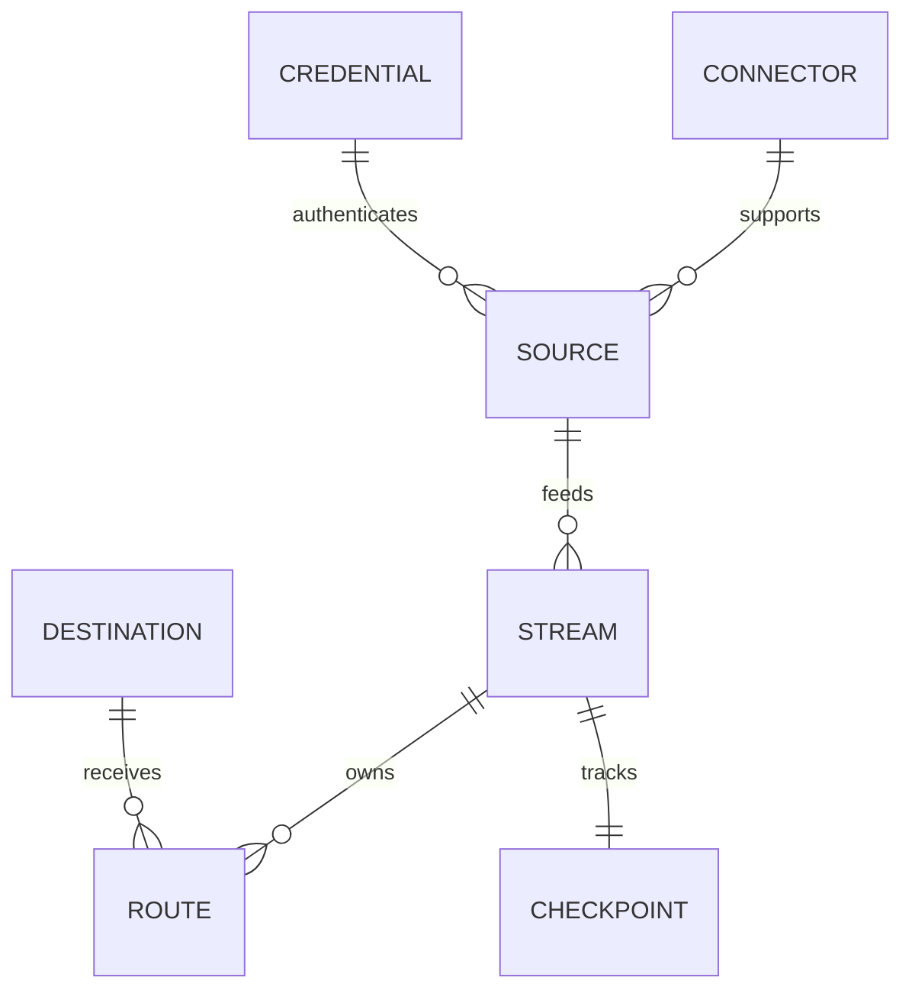

# Data Model

The exact database schema is managed by Alembic migrations. The conceptual model operators need is:

## Ownership rules

**Stream** is the runtime execution and source/checkpoint ownership unit.

**Route** is the destination-specific processing and delivery unit.

**Credential** owns secret-bearing authentication state separately from package files.

**Source Pack** is package/catalog content and does not execute the Stream.

**Audit/runtime evidence** records what occurred; it does not replace the configuration entities.

## Database

PostgreSQL is the platform database. SQLite is not a supported fallback.
